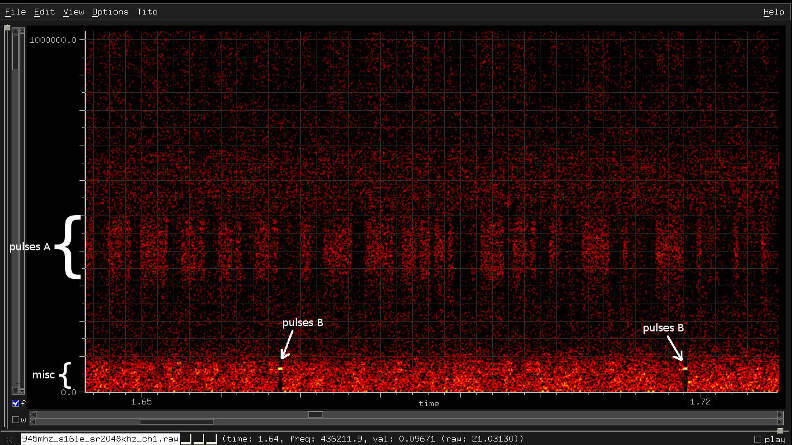
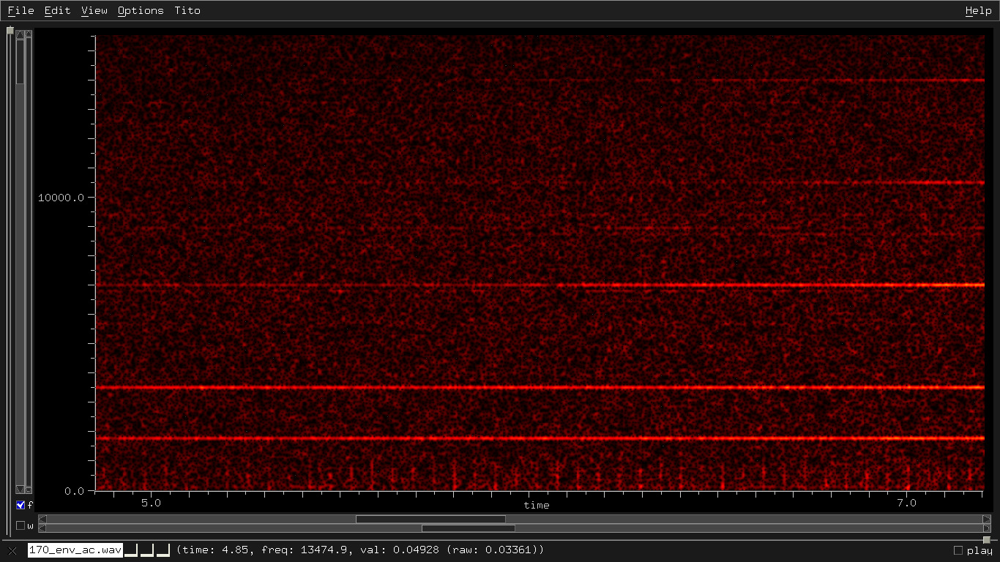

# Analisi di un attacco elettromagnetico

L'attacco è iniziato l'anno scorso, il 15 Luglio 2017.

La deficienza artificiale coordina le sequenze e la psicologia dei
dialoghi, spesso offensivi, e le interferenze alle normali oscillazioni
neurali che disturbano il sonno con tremori, convulsioni, etc.

Il video seguente mostra una parte del segnale diretto alla mia testa:


[head_945mhz.mp4 (View Raw)](https://raw.githubusercontent.com/titola/neuropa/master/media/head_945mhz.mp4)

[head_945mhz.mp4](https://github.com/titola/neuropa/blob/master/media/head_945mhz.mp4)

In Italia "La libertà personale è inviolabile". [1]

La mia testa è puntata continuamente, probabilmente utilizzando la
tecnologia dei missili deficienti.

I criminali usano la radio senza limiti di frequenza, disturbando
anche le trasmissioni musicali in FM.

Ci sono almeno quattro posizioni fisse degli attaccanti. Le misure
sono state prese a Roma (nord), il 5 Giugno 2018, utilizzando SDR,
un'antenna semplice ed una bussola digitale.

  - NNE 20°
  - NNW 338°
  - tra SW 227° e WSW 251°
  - tra E 92° e SE 127°

Voglio condividere l'analisi di questo attacco per rompere il velo di
mistero, spesso divulgato ignorantemente adoperando la parola "cospirazione".

Ho analizzato la dinamica completa dell'attacco, mi sono informato ed
ho raccolto le prove. Questo documento contiene quello che posso spiegare
senza equivoci (20% dell'attacco complessivo ma scriverò altro e migliorerò
la struttura del documento). Sono un semplice musicista e programmatore.

La decodifica è migliorabile (ho usato un semplice slope detector), ma
se senti una voce nel file audio

[cuba_attack_decoded.ogg (View Raw)](https://raw.githubusercontent.com/titola/neuropa/master/media/cuba_attack_decoded.ogg)

[cuba_attack_decoded.ogg](https://github.com/titola/neuropa/blob/master/media/cuba_attack_decoded.ogg)

anche gli [ambasciatori americani a Cuba](https://en.wikipedia.org/wiki/Embassy_attack_accusations_in_Cuba)
hanno subito inconsapevolmente un'azione offensiva simile, perché quello che
hai appena ascoltato è nascosto in una registrazione pubblicata [2]. Forse il
segnale utilizzato è stato rettificato da un effetto Hall anomalo in qualche
materiale ferromagnetico [3]. Quindi gli ambasciatori hanno ascoltato
accidentalmente il risultato di un inseguitore d'inviluppo.

## Indice

- [Segnale privato](#segnale-privato)
- [Codifica della voce](#codifica-della-voce)
- [Segnale pubblico](#segnale-pubblico)
- [Ipotesi sull'attacco subito dagli ambasciatori americani a Cuba](#ipotesi-sullattacco-subito-dagli-ambasciatori-americani-a-cuba)
    - [Metodi per ottenere le voci dalla registrazione audio](#metodi-per-ottenere-le-voci-dalla-registrazione-audio)
- [Altri segnali da analizzare](#altri-segnali-da-analizzare)
    - [Eventi sincronizzati con le voci](#eventi-sincronizzati-con-le-voci)
- [Riferimenti](#riferimenti)

## Segnale privato

Il sonogramma di una registrazione di una parte del segnale che ho in
testa, con frequenza centrale di circa 945 MHz e frequenza di campionamento
pari a 2 MHz, mette in evidenza le pulsazioni principali:



Durante la registrazione i criminali infami abbassano il livello delle
voci ed aumentano il rumore. Recentemente il livello delle voci è
molto basso anche quando non registro, comunque l'intensità del
[tinnitus](https://it.wikipedia.org/wiki/Acufene) indotto rimane
invariato.

Un impulso in "pulses A" è generato dalla somma di 100 sinusoidi
separate da circa 1733 Hz, quindi la larghezza di banda è 173.3 kHz.

Un impulso in "pulses B" è la somma di 7 sinusoidi separate da 216.6 Hz
(= 1733/8). I periodi di ripetizione della pulsazione formano il
pattern seguente:

```
A A A A B A A A A B A A A A B ...

A = 0.0461 s = 80 / 1733  => 21.69 Hz
B = 0.0511 s = 75 / 1469  => 19.57 Hz
freq_media = 5 / ((A * 4) + B) = 21.23 Hz
```

Ho simulato il tinnitus prodotto da questo segnale in base al
demodulatore termo-acustico descritto nella sezione "Codifica della voce":

[tinnitus_pulses.wav (View Raw)](https://raw.githubusercontent.com/titola/neuropa/master/media/tinnitus_pulses.wav)

[tinnitus_pulses.wav](https://github.com/titola/neuropa/blob/master/media/tinnitus_pulses.wav)

Ho preferito utilizzare un modello sorgente-filtro invece di sintetizzare
le frequenze acustiche, quindi l'onda termo-elastica è approssimata da
un treno d'impulsi con pattern A-A-A-A-B e frequenza media di 21.23 Hz
(gli altri impulsi sono esclusi per semplificare il modello) filtrato
dal filtro di conduzione disegnato in base alla figura 4 in [4].
Questo tipo di segnale interferisce in modo particolare con le
oscillazioni neurali (gli altri impulsi variabili possono modulare
specifiche onde cerebrali con ritmi diversi) prima di raggiungere
l'orecchio interno.

E' possibile calcolare l'ampiezza della pressione indotta utilizzando
la formula ed i fattori di ampiezza della figura 4 in [4]:

```
P(pulse_width) = A*abs(sin(pi*freq*pulse_width)) =

= 572*abs(sin(pi*7800/(216.625*7))) = 2.49e-4 Pa (circa 22 dB SPL)
```

dove 7800 Hz è la frequenza acustica principale.

Il file audio seguente contiene un fastidioso intervallo di sesta
minore tra il tinnitus simulato a 21.2 Hz ed un'oscillazione di circa
35.4 Hz (l'ascolto richiede cuffie decenti):

[tinnitus_plus_6min.wav (View Raw)](https://raw.githubusercontent.com/titola/neuropa/master/media/tinnitus_plus_6min.wav)

[tinnitus_plus_6min.wav](https://github.com/titola/neuropa/blob/master/media/tinnitus_plus_6min.wav)

L'esempio della sesta minore non è casuale ma sono stato ispirato
da alcune registrazioni audio che catturano suoni a bassa frequenza
udibili ed infrasuoni. Il ritaglio seguente è amplificato di 40 dB:


[low_freq_with_6min_for_tinnitus.wav](https://github.com/titola/neuropa/blob/master/media/low_freq_with_6min_for_tinnitus.wav)

I criminali (sotto protezione) usano questi suoni anche per sfruttare
l'interazione con il tinnitus. Aggiungerò una sezione dedicata alle
registrazioni audio notturne contenenti suoni generati tramite interferenze
elettromagnetiche intenzionali: impulsi ripetuti ogni 1.9 secondi,
un segnale continuo con frequenza fondamentale di 7.62 Hz ed altre
frequenze che formano rapporti semplici con 50 Hz, la frequenza
nominale della rete elettrica in Italia [5], per esempio:

```
100 = 50 * 2
66.6 = 50 * 4/3
216.6 = 50 * 13/3
50 = 96 / [periodo di ripetizione dei picchi] = 96 / 1.92

errori "scintillanti" sporadici:
  5415 = 216.6 * 25
  1155 = 216.6 * 16/3
```

Infine, la parte etichettata "misc" nel primo sonogramma comprende
impulsi generati dalla somma di sinusoidi separate da 1469 Hz e da
altre sinusoidi separate ancora da 1469 Hz.

## Codifica della voce

Hanno usato più tecniche.

Una semplice ricetta per ottenere "pulses A" è la seguente:

- Segnale sinusoidale con frequenza 14.5 kHz modulato in frequenza dal suono di una voce.

- Impulso generato ogni volta che l'ampiezza del segnale modulato passa da positiva a negativa

Gli impulsi sono generati da somme di sinusoidi separate da frequenze
che provocano un incessante tinnitus risonante nella mia testa.

Ogni volta che l'energia di un impulso è assorbita dal tessuto
cerebrale, la temperatura sale di 5e-6 °C [6]. La rapida espansione
termica produce un'onda termo-elastica che raggiunge l'orecchio
interno. Quindi i criminali utilizzano questo demodulatore
termo-acustico per inviarmi messaggi vocali tramite ultrasuoni.

Questa informazione disinnesca l'arma psicologica perché elimina
l'effetto suggestivo. Rimane quello puerile "suona il citofono e
scappa" più i fastidiosi effetti collaterali (da descrivere in una
sezione separata).

## Segnale pubblico

Anche i miei vicini di casa ricevono questo tipo di segnale:


E' nervoso e cerca di offuscare le sue intenzioni. Spesso è
accompagnato da un'imitazione attenuata e distante circa 91.2 kHz:


Il 18 Luglio 2018 ho contato circa 45 componenti di questo tipo, 5 tra
80 e 88 MHz ed almeno 40 tra 120 e 170 MHz.

L'autocorrelazione dell'inviluppo rivela la firma del mittente:
risonanze multiple di circa 1740 Hz ed impulsi ripetuti con una
frequenza di circa 18 Hz e larghezza di banda inferiore a 1600 Hz.

Esempio: frequenza centrale 138 MHz


Esempio: frequenza centrale 160 MHz


Esempio: frequenza centrale 170 MHz



L'energia degli impulsi di oltre quaranta componenti è assorbita dal tessuto
cerebrale, quindi si abbassa il valore di soglia da raggiungere per generare
l'onda termo-acustica.

## Ipotesi sull'attacco subito dagli ambasciatori americani a Cuba

Il suono registrato a Cuba ha caratteristiche simili al segnale di
945MHz che ricevo in testa. La differenza fondamentale è la distanza
in frequenza tra le sinusoidi che formano gli impulsi. Nel mio caso:

- Impulsi con sinusoidi separate da 216.6 Hz e periodo di ripetizione delle pulsazioni con pattern A-A-A-A-B (vedi sopra).

- Impulsi con sinusoidi separate da 1733 Hz e periodo di ripetizione delle pulsazioni variabile.

Nel caso cubano, la frequenza di separazione è sempre circa 180 Hz ma
il clock di circa 21 Hz è lo stesso.

Le ampiezze del sonogramma seguente sono espresse in dB per
evidenziare la parte filtrata dal registratore o dall'editor:


Il prossimo sonogramma mostra invece il clock che ho in testa
(ampiezza lineare) sotto 1733 Hz (visibile in alto), demodulato,
sotto-campionato e registrato in un file audio:


Ci sono due tipi di impulso:

- Impulsi con sinusoidi separate da 180 Hz, larghezza di banda complessiva di 3960 Hz e frequenza di pulsazione di circa 21 Hz.

- Impulsi con sinusoidi separate da 180 Hz e periodo di ripetizione variabile.

### Metodi per ottenere le voci dalla registrazione audio

-   Filtro FIR per selezionare il contenuto tra 6 e 9 kHz.

-   Alza di un'ottava (facoltativo)

    ```
    # esempio
    rubberband -f2 in.wav out.wav
    ```

-   Slope detector.

    ```
    pseudo-codice: env_follower(diff(input))
    ```

-   Filtro BP per selezionare il contenuto tra 100Hz e 3.5kHz.

[cuba_attack_decoded.ogg (View Raw)](https://raw.githubusercontent.com/titola/neuropa/master/media/cuba_attack_decoded.ogg)

[cuba_attack_decoded.ogg](https://github.com/titola/neuropa/blob/master/media/cuba_attack_decoded.ogg)

Metodo alternativo:

-   Filtro FIR per selezionare il contenuto tra 6 e 9 kHz.

-   Convoluzione tra una serie d'impulsi ed un FIR BP, fmin=100Hz e fmax=3kHz.

    ```
    # pseudo-codice per generare la serie d'impulsi

    d[n] = in[n] - in[n-1]
    if d[n] < 0 and d[n-1] >= 0
        then out[n] = in[n-1]
        else out[n] = 0
    endif
    ```

[cuba_attack_decoded_alt.ogg (View Raw)](https://raw.githubusercontent.com/titola/neuropa/master/media/cuba_attack_decoded_alt.ogg)

[cuba_attack_decoded_alt.ogg](https://github.com/titola/neuropa/blob/master/media/cuba_attack_decoded_alt.ogg)

## Altri segnali da analizzare

### Eventi sincronizzati con le voci

Questo tipo di segnale è sincronizzato con le voci:


Ricevuto alle frequenze 173.456 MHz, 173.880 MHz, 173.956 MHz e
460.557 MHz con larghezza di banda pari a 4 kHz.

Un segnale sinusoidale scende dalla frequenza massima a quella
centrale e continua per una durata da 0.072 a 0.076 secondi, poi
prosegue modulato in ampiezza da una sinusoide di 2 kHz (mix di due
sinusoidi laterali) per 0.034 secondi. Inizia una specie di rumore con
LTAS (Long-Term Average Spectrum) quasi uniforme nella banda passante:


Il segnale sinusoidale finale dura circa 0.034 secondi.

La durata della parte rumorosa (forse una nuvola di grani sinusoidali)
dipende dalla voce percepita.

Il segnale seguente è simile ma dura 0.178 secondi ed è ripetuto ogni
1.92 secondi

```
# 96 cicli della frequenza nominale della rete elettrica
1.92 = 96 / 50
```

e senza segnali sinusoidali isolati:


Ricevuto alle frequenze 421.684 MHz (bw 5kHz invece di 4kHz) e 422.733 MHz
(bw 3kHz invece di 4kHz).

Nota la durata di 0.178 secondi ed il periodo di ripetizione di 1.92
secondi nelle registrazioni audio che contengono suoni a bassa frequenza
udibili ed infrasuoni:


[low_freq_with_6min_for_tinnitus.wav](https://github.com/titola/neuropa/blob/master/media/low_freq_with_6min_for_tinnitus.wav)

Nota: 421.684 MHz non è presente in una registrazione del 23 Agosto 2018
e la larghezza di banda a 422.733 MHz diventa 5kHz. Il confronto sarà
utile per comprendere meglio la sintesi e la funzione del segnale audio
a bassa frequenza.

## Riferimenti

[1] Costituzione della Repubblica Italiana, articolo 13.

[2] Josh Lederman and Michael Weissenstein. Dangerous sound?
What Americans heard in Cuba attacks. AP News, October 2017.

[3] Hang Chen, Xiaolong Fan, Hengan Zhou, Wenxi Wang, Y. S. Gui,
C.-M. Hu, and Desheng Xue. Spin rectification enabled by anomalous
Hall effect.

[4] N. M. Yitzhak, R. Ruppin, R. Hareuveny. Numerical Analysis of the
Microwave Auditory Effect.

[5] Coincidenze: un contatore trifase rotto l'anno scorso durante
l'inizio dell'attacco ed un contatore dei servizi inutilizzabile
qualche mese fa perché erano stati tirati i fili. Inoltre, se spengo
il contatore dei servizi, l'intensità delle vibrazioni delle torture
notturne diminuisce.

[6] J.A. Elder and C.K. Chou. Auditory Response to Pulsed
Radiofrequency Energy.
